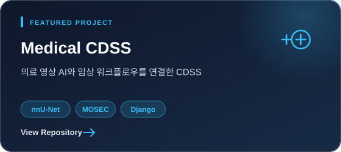
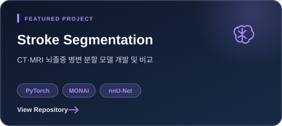
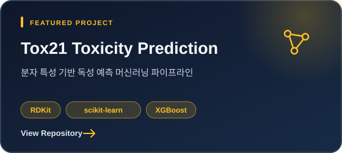
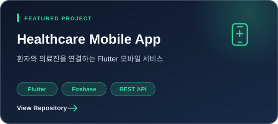

  

  의료 데이터를 바탕으로 문제를 정의하고, 
  <strong>데이터 검증부터 모델 개발과 서비스 구현까지</strong> 연결하는 과정을 공부하고 있습니다.

---

## About Me

- 의료 AI와 헬스케어 IT 분야에 관심이 있습니다.
- 의료영상 데이터 분석 및 머신러닝 모델 개발 경험을 쌓고 있습니다.
- 분석 결과가 실제 서비스와 임상 워크플로우로 이어지는 과정을 중요하게 생각합니다.

<!-- TODO: 지원 직무에 맞춰 자기소개, 교육 과정, 연구 경험과 강점을 구체화 -->

## Tech Stack

**AI & Data**

**Backend & Database**

**Frontend & Mobile**

**Cloud & Tools**

<!-- TODO: 실제 사용 수준을 검토한 뒤 기술을 추가하거나 정리 -->

## Featured Projects

<table>
  <tr>
    <td width="50%">
      
    </td>
    <td width="50%">
      
    </td>
  </tr>
  <tr>
    <td width="50%">
      
    </td>
    <td width="50%">
      
    </td>
  </tr>
</table>

<!-- TODO: 프로젝트별 담당 역할, 기술 스택, 문제 해결 과정과 정량적 결과 추가 -->

## Experience & Education

<!-- TODO: 교육 과정, 학부 연구 경험, 프로젝트 기간과 역할 추가 -->

## Certifications

<!-- TODO: SQLD, ADsP 등 자격증과 취득 시점 추가 -->

## Contact

<!-- TODO: 공개할 이메일 또는 LinkedIn 추가 -->
