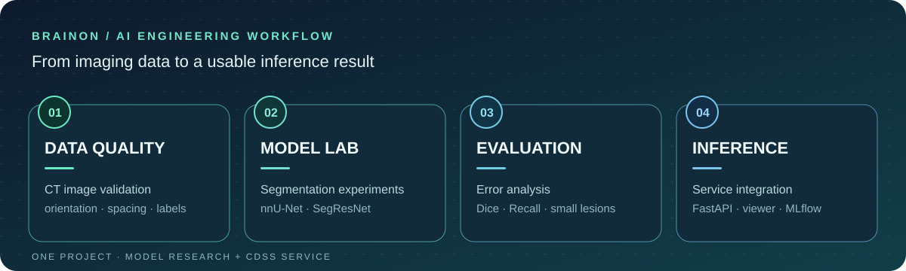

  

  <strong>데이터를 검증하고, 모델을 실험·개선하며, 추론 결과를 서비스로 연결합니다.</strong> 
  데이터 품질 확인부터 모델 평가, 추론 API, 결과 시각화까지 경험한 AI 엔지니어 김호영입니다.

  <a href="#featured-project">PROJECT</a> &nbsp;•&nbsp;
  <a href="#what-i-did">MY WORK</a> &nbsp;•&nbsp;
  <a href="#tech-stack">STACK</a>

 

## 01 / Featured Project

### BrainOn 의료영상 AI · 임상 의사결정 지원 시스템

**CT · MRI · MRA 영상 분석을 의료진의 진료 흐름에 연결한 4인 팀 프로젝트**

의료영상 분할 모델을 연구·실험하고, 추론 결과를 의료진 웹에서 확인할 수 있도록 연결했습니다. 데이터 품질 검증, 모델 실험·평가, 추론 파이프라인, 분석 결과 화면 연동을 중심으로 담당했습니다.

  

  <strong>Explore the project</strong> &nbsp;
  <a href="https://github.com/duddl6292/stroke-model">모델 실험 저장소 ↗</a> &nbsp;·&nbsp;
  <a href="https://github.com/brainCDSS/BrainCDSS/tree/dev">BrainOn 팀 서비스 ↗</a>

두 저장소는 하나의 BrainOn 프로젝트를 모델 연구와 서비스 구현으로 나누어 관리합니다. 팀 저장소는 접근 권한이 필요할 수 있습니다.

  

## 02 / My Work

**데이터 품질** &nbsp; CT 영상의 방향·간격·레이블을 점검하고 전처리 기준을 정리했습니다.

**모델 실험** &nbsp; nnU-Net과 SegResNet을 바탕으로 손실 함수·샘플링·입력 구조를 비교하고, Dice·Recall·Precision과 병변 크기별 결과로 실패 양상을 분석했습니다.

**추론 연결** &nbsp; 모델 로딩과 FastAPI 추론 API를 Django·Celery·GCS 흐름에 연결했습니다. 의료영상 뷰어에 병변 정보·확률 맵·XAI 결과를 표시하고 MLflow 관리자 연동에 참여했습니다.

> BrainOn에서 익힌 데이터 검증, 실험 설계, 실패 분석, 추론 구현 방식을 새로운 문제와 데이터에도 적용하고자 합니다.

 

## 03 / Tech Stack

| AI · Data | API · Serving | Product · Tools |
| :--- | :--- | :--- |
| Python · PyTorch MONAI · nnU-Net SegResNet · NumPy | FastAPI · Django REST Framework Celery · RabbitMQ Docker · Cloud Run · GCS | MLflow · PostgreSQL React · TypeScript Git · GitHub |

<b>Background &amp; Credentials</b>

 

- 기계공학 전공 · MMM 연구실 학부연구생 (자기장 에너지 하베스팅 연구)
- Biomedical AI 과정 · 2026.03–2026.09
- SQLD · ADsP

 

---

  <strong>데이터 검증 → 모델 실험 → 성능 분석 → 추론 서비스</strong> 
  김호영 · AI Engineer

