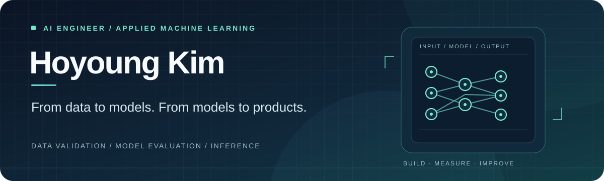

  

  <strong>영상 데이터를 검증하고, 모델을 실험·개선하며, 추론 결과를 서비스로 연결합니다.</strong> 
  의료영상 AI 프로젝트를 통해 데이터 품질 확인부터 모델 평가, 추론 API, 결과 시각화까지 경험한 김호영입니다.

  <a href="#featured-project">PROJECT</a> &nbsp;•&nbsp;
  <a href="#what-i-did">MY WORK</a> &nbsp;•&nbsp;
  <a href="#tech-stack">STACK</a>

 

## 01 / Featured Project

### BrainOn 의료영상 AI · 임상 의사결정 지원 시스템

**CT · MRI · MRA 영상 분석을 의료진의 진료 흐름에 연결한 4인 팀 프로젝트**

의료영상 분할 모델을 연구·실험하고, 추론 결과를 의료진 웹에서 확인할 수 있도록 연결했습니다. 데이터 품질 검증, 모델 실험·평가, 추론 파이프라인, 분석 결과 화면 연동을 중심으로 담당했습니다.

<table>
  <tr>
    <td width="50%" valign="top">
      <h4>01 &nbsp; Data &amp; Model</h4>
      
CT 데이터 품질 점검과 전처리 
      nnU-Net · SegResNet 분할 실험 
      손실 함수·샘플링·입력 구조 비교

    </td>
    <td width="50%" valign="top">
      <h4>02 &nbsp; Evaluation</h4>
      
Dice · Recall · Precision 비교 
      병변 크기별 성능과 실패 양상 분석 
      실험 결과를 바탕으로 개선 방향 탐색

    </td>
  </tr>
  <tr>
    <td width="50%" valign="top">
      <h4>03 &nbsp; Inference</h4>
      
FastAPI 공통 추론 인터페이스 
      Django · Celery 분석 요청 연동 
      GCS 모델·결과 저장 흐름 연결

    </td>
    <td width="50%" valign="top">
      <h4>04 &nbsp; Result &amp; MLOps</h4>
      
뷰어에 마스크·확률 맵·XAI 표시 
      MLflow 모델 정보의 관리자 화면 연동 
      모델 결과를 서비스에서 조회 가능하게 구성

    </td>
  </tr>
</table>

  <strong>Explore the project</strong> &nbsp;
  <a href="https://github.com/duddl6292/stroke-model">모델 실험 저장소 ↗</a> &nbsp;·&nbsp;
  <a href="https://github.com/brainCDSS/BrainCDSS/tree/dev">BrainOn 팀 서비스 ↗</a>

두 저장소는 하나의 BrainOn 프로젝트를 모델 연구와 서비스 구현으로 나누어 관리합니다. 팀 저장소는 접근 권한이 필요할 수 있습니다.

  

## 02 / My Work

| 단계 | 직접 수행한 작업 |
| :--- | :--- |
| **Data** | CT 영상의 방향·간격·레이블을 점검하고 전처리 기준을 정리 |
| **Model** | nnU-Net·SegResNet 기반 손실 함수와 샘플링 방식 비교 |
| **Evaluate** | Dice·Recall·Precision과 병변 크기별 결과로 실패 양상 분석 |
| **Serve** | 모델 로딩과 FastAPI 추론 API를 Django·Celery·GCS 흐름에 연결 |
| **Present** | 의료영상 뷰어에 병변 정보·확률 맵·XAI 결과를 표시하고 MLflow 관리자 연동에 참여 |

> 주력 경험은 **의료영상 AI**입니다. 영상 모델을 개발·평가하고 서비스에 연결한 경험을 다른 영상 분야에도 적용하고자 합니다.

 

## 03 / Tech Stack

| AI · Data | API · Serving | Product · Tools |
| :--- | :--- | :--- |
| Python · PyTorch MONAI · nnU-Net SegResNet · NumPy | FastAPI · Django REST Framework Celery · RabbitMQ Docker · Cloud Run · GCS | MLflow · PostgreSQL React · TypeScript Git · GitHub |

<b>Background &amp; Credentials</b>

 

- 기계공학 전공 · MMM 연구실 학부연구생 (자기장 에너지 하베스팅 연구)
- Biomedical AI 과정 · 2026.03–2026.09
- SQLD · ADsP

 

---

  <strong>데이터 검증 → 모델 실험 → 성능 분석 → 추론 서비스</strong> 
  김호영 · AI Engineer

